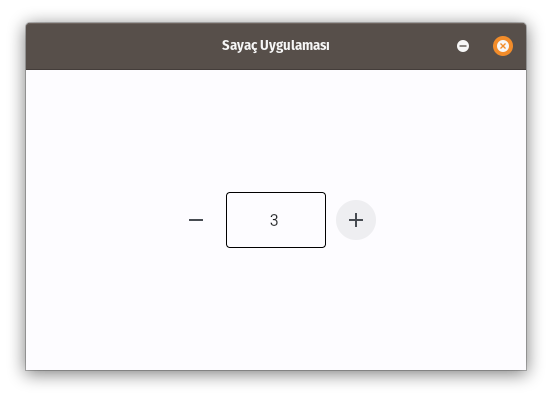

# Flet Nedir?

Flet, front-end geliştirme deneyimi olmadan, en sevdiğiniz programlama dilinde etkileşimli, çok kullanıcılı web, masaüstü ve mobil uygulamalar oluşturmaya izin veren bir çerçevedir.  

Google'ın Flutter'ını temel alan Flet denetimleriyle, programınız için bir kullanıcı arabirimi oluşturursunuz. Flet, Flutter widget'larını yalnızca "sarmalamakla" kalmaz, aynı zamanda daha küçük widget'ları birleştirerek, karmaşıklıkları gizleyerek, UI (kullanıcı arabirimi) en iyi uygulamalarını uygulayarak, makul varsayılanları uygulayarak kendi "görüşünü" ekler, tüm bunlar, uygulamalarınızın fazladan çaba harcamadan havalı ve profesyonel görünmesini sağlar.

## Flet uygulaması örneği

Tabi aşağıdaki örneği yazıp çalıştırmak için öncelikle **flet modülü**nü yüklemek gerekir. Aşağıdaki kodu kullanarak flet modülünü (kütüphanesini) yükleyebilirsiniz:

```
pip install flet
```

Şu anda Python'da Flet uygulamaları yazabilirsiniz ve diğer diller yakında eklenecektir.  

Aşağıda örnek bir "Sayaç (Counter)" uygulamasına ait kodlar bulunmaktadır:

```python
import flet as ft

def main(page: ft.Page):
    page.title = "Flet counter example"
    page.vertical_alignment = ft.MainAxisAlignment.CENTER

    txt_number = ft.TextField(value="0", text_align=ft.TextAlign.RIGHT, width=100)

    def minus_click(e):
        txt_number.value = str(int(txt_number.value) - 1)
        page.update()

    def plus_click(e):
        txt_number.value = str(int(txt_number.value) + 1)
        page.update()

    page.add(
        ft.Row(
            [
                ft.IconButton(ft.icons.REMOVE, on_click=minus_click),
                txt_number,
                ft.IconButton(ft.icons.ADD, on_click=plus_click),
            ],
            alignment=ft.MainAxisAlignment.CENTER,
        )
    )

ft.app(target=main)
```

kodu çalıştırmak için (dosya adının counter.py olduğunu varsayıyorum);

```
python counter.py
```

Uygulama, yerel bir işletim sistemi penceresinde başlatılacak. Electron'a ne güzel bir alternatif!

**macOS**


**Windows**


**Linux**



```python
ft.app(target=main, view=ft.WEB_BROWSER)
```

Kodu tekrar çalıştırın ve şimdi anında bir web uygulamasına sahip olursunuz:


| Önceki Bölüm                                      | Sonraki Bölüm                                 |
| ------------------------------------------------- | --------------------------------------------- |
| [<<< 01 Temel Özellikler](01_temel_ozellikler.md) | [03 Python Rehberi >>>](03_python_rehberi.md) |
