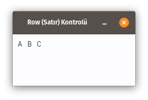
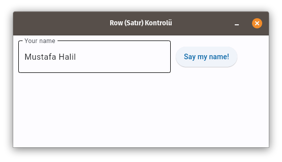

# Python Rehberi

# Python'da Flet uygulamaları oluşturma

Bir **Flet** uygulaması yazmak için front-end gurusu olmanız gerekmez, ancak temel 
**Python** bilgisine ve Nesne Yönelimli Programlama (OOP) bilgisine sahip olmanız önerilir.

Bu kılavuzda (rehberde), bir Flet uygulamasının yapısını inceleyeceğiz, **Flet** **kontrollerini** kullanarak veri çıktısını almayı, bir kullanıcıdan veri istemeyi ve temel sayfa düzenleri oluşturmayı öğreneceğiz. 
Kullanıcılarınıza hazır bir uygulama sunmak için bazı paketleme ve dağıtım seçeneklerini de ele alacağız.

## Flet modülünü yükleme

**Flet**, <u>Python 3.7 veya üst sürümünü</u> gerektirir. Flet ile arabirim oluşturmak için önce **flet** modülünü kurmanız gerekir:

```
pip install flet
```

> Flet modülünü yükseltmek için aşağıdaki kodu çalıştırmalısınız:
> 
> ```
> pip install flet --upgrade
> ```

Flet ön sürümünü (pre-release) yüklemek için (ileri düzey kullanıcılar için) aşağıdaki kodu çalıştırın:

```
pip install flet --pre
```

> Dikkat!
> 
> Ön sürüm (pre-release) yapılarını, bir sanal ortama yüklemenizi öneririz.

### Linux

**Flet** uygulamalarını Linux ve **WSL**'de çalıştırmak için [GStreamer](https://gstreamer.freedesktop.org/) kitaplıklarının kurulu olması gerekir. Büyük olasılıkla zaten sisteminizde vardır, ancak Flet uygulamasını çalıştırırken `error while loading shared libraries: libgstapp-1.0.so.0: cannot open shared object file: No such file or directory` şeklinde hata alıyorsanız, **GStreamer**'ı yüklemeniz gerekir .

GStreamer'ı Ubuntu/Debian'a yüklemek için aşağıdaki komutları çalıştırın:

```
sudo apt-get update
sudo apt-get install libgstreamer1.0-dev libgstreamer-plugins-base1.0-dev libgstreamer-plugins-bad1.0-dev gstreamer1.0-plugins-base gstreamer1.0-plugins-good gstreamer1.0-plugins-bad gstreamer1.0-plugins-ugly gstreamer1.0-libav gstreamer1.0-doc gstreamer1.0-tools gstreamer1.0-x gstreamer1.0-alsa gstreamer1.0-gl gstreamer1.0-gtk3 gstreamer1.0-qt5 gstreamer1.0-pulseaudio
```

GStreamer'ı, diğer Linux dağıtımlarına yüklemek için [bu kılavuza](https://gstreamer.freedesktop.org/documentation/installing/on-linux.html?gi-language=c) göz atın.

### WSL

Flet uygulamaları WSL2'de çalıştırılabilir. `cannot open display (ekran açılamıyor)` hatası alıyorsanız, sorun giderme için [bu kılavuza](https://github.com/microsoft/wslg/wiki/Diagnosing-%22cannot-open-display%22-type-issues-with-WSLg) göz atın.  

# Temel uygulama yapısı

Çok minimal bir Flet uygulaması aşağıdaki yapıya sahiptir:

```python
import flet as ft

def main(page: ft.Page):
    # add/update controls on Page
    pass

ft.app(target=main)
```


> **NOT:**
> 
> Bu kılavuzda daha sonra yeniden kullanılabilir **kontrollerle** uygulama yapısına gerçek dünya yaklaşımları yönünden bakacağımız için bu bölüm kasıtlı olarak **temel** olarak adlandırılmıştır.

Tipik bir Flet programı, uygulamanın yeni kullanıcı oturumlarını beklemeye başladığı `flet.app()` çağrısıyla sona erer. `main()` fonksiyonu, bir Flet uygulamasındaki giriş noktasıdır. `Page (Sayfa)` örneğinin aktarıldığı her kullanıcı oturumu için yeni bir iş parçacığı çağrılıyor. Flet uygulamasını tarayıcıda çalıştırırken, açılan her sekme veya sayfa için yeni bir kullanıcı oturumu başlatılır. Bir masaüstü uygulaması olarak çalışırken oluşturulan yalnızca bir oturum vardır.

`Page (Sayfa)`, kullanıcıya özgü bir "**canvas (tuval)**" gibidir, kullanıcı oturumunun görsel halidir. Bir uygulama arabirimi oluşturmak için bir sayfaya (page) kontroller ekler ve kaldırırsınız, kontrollerin özelliklerini güncellersiniz. Yukarıdaki kod örneği, içerisine hiçbir kontrol eklenmediği için her kullanıcıya sadece boş bir sayfa (page) görüntüleyecektir.

Flet uygulaması, varsayılan olarak, yerel işletim sistemine penceresinde başlar. Ancak, `flet.app` çağrısını aşağıdaki gibi değiştirerek onu yeni bir tarayıcı penceresinde açabilirsiniz:

```python
ft.app(target=main, view=ft.WEB_BROWSER)
```

> **NOT**:
> 
> Dahili olarak, her Flet uygulaması bir web uygulamasıdır ve yerel bir işletim 
> sistemi penceresinde açılsa bile yerleşik bir web sunucusu arka planda başlatılır. Flet web sunucusuna "**Fletd**" adı verilir ve varsayılan olarak rastgele bir **TCP** bağlantı noktasını dinler. Özel bir TCP bağlantı noktası belirtebilir ve ardından uygulamayı masaüstü görünümüyle birlikte tarayıcıda açabilirsiniz:
> 
> ```python
> flet.app(port=8550, target=main)
> ```
> 
> Flet uygulamanızın web sürümünü görmek için tarayıcınızda `http://localhost:<port>` öğesini açın.

# Kontroller

Kullanıcı arayüzü, **Kontrollerden (Controls)** (widget olarak da bilinir) yapılmıştır. 
Kontrollerin bir kullanıcı tarafından görülebilmesi için bir `Sayfaya (Page)` veya diğer kontrollerin içine eklenmesi gerekir. Page (Sayfa), en üstteki denetimdir. İç içe geçmiş denetimler, kök olarak Page (Sayfa) ile bir ağaç yapısı olarak temsil edilebilir.

Kontroller, temelde normal Python sınıflarıdır. Özellikleriyle eşleşen parametreleri kullanarak, yapıcılar (constructors) aracılığıyla kontrol örnekleri oluşturulur. örneğin:

```python
t = ft.Text(value="Hello, world!", color="green")
```

Bir sayfada kontrolü görüntülemek istiyorsanız, o kontrolü sayfanın `kontroller (controls)` listesine eklemeli ve sayfa değişikliklerini bir tarayıcıya veya masaüstü istemcisine göndermek / güncellemek için `page.update()` öğesini çağırmalısınız:

```python
import flet as ft

def main(page: ft.Page):    
    t = ft.Text(value="Hello, world!", color="green")    
    page.controls.append(t)    
    page.update()

ft.app(target=main)
```


> **NOT**:
> 
> Aşağıdaki örneklerde sadece ana (main) fonksiyonun içeriğini göstereceğiz.

Kontrol özelliklerini değiştirebilirsiniz ancak yaptığınız değişiklikler kullanıcı arayüzünde bir sonraki `page.update():` komutu ile güncellenecektir. 

```python
t = ft.Text()
page.add(t) # it's a shortcut for page.controls.append(t) and then page.update()

for i in range(10):
    t.value = f"Step {i}"
    page.update()
    time.sleep(1)
```

Bazı kontroller, diğer kontrolleri içerebilen "kapsayıcı (container)" kontrollerdir ( Page (Sayfa) gibi ). Örneğin, `Row (Satır)` kontrolü, diğer kontrollerin bir satırda tek tek düzenlenmesine izin verir:

```python
page.add(
    ft.Row(controls=[
        ft.Text("A"),
        ft.Text("B"),
        ft.Text("C")
    ])
)
```



veya `TextField` (metin alanı) ve yanında `ElevatedButton` (Yükseltilmiş Düğme):

```python
page.add(
    ft.Row(controls=[
        ft.TextField(label="Your name"),
        ft.ElevatedButton(text="Say my name!")
    ])
)
```



`page.update()` yalnız son çağrısından bu yana yapılan değişiklikleri güncelleyecek 
kadar akıllıdır. Bir sayfaya birkaç yeni kontrol ekleyebilir, bazılarını kaldırabilir, diğer kontrollerin özelliklerini değiştirebilirsiniz ancak bu değişikliklerin  topluca güncellenmesi için `page.update()`'i çağırabilirsiniz. , örneğin:

```python
for i in range(10):
    page.controls.append(ft.Text(f"Line {i}"))
    if i > 4:
        page.controls.pop(0)
    page.update()
    time.sleep(0.3)
```

Düğmeler (Butonlar) gibi bazı kontroller (denetimler), bir kullanıcı girişine tepki veren olay işleyicilere sahip olabilir, örneğin `ElevatedButton.on_click:` (butona tıklamak gibi)

```python
def button_clicked(e):
    page.add(ft.Text("Clicked!"))

page.add(ft.ElevatedButton(text="Click me", on_click=button_clicked))
```

ve basit bir Yapılacaklar Lisesi (To-Do) için daha gelişmiş bir örnek:

```python
import flet as ft

def main(page):
    def add_clicked(e):
        page.add(ft.Checkbox(label=new_task.value))
        new_task.value = ""
        new_task.focus()
        new_task.update()

    new_task = ft.TextField(hint_text="Whats needs to be done?", width=300)
    page.add(ft.Row([new_task, ft.ElevatedButton("Add", on_click=add_clicked)]))

ft.app(target=main)
```


> **NOT**:
> **Flet**, kullanıcı arayüzünü durum bilgisi olan kontrollerle "manuel" oluşturduğunuz ve ardından kontrol özelliklerini güncelleyerek değişikliğe uğrattığınız zorunlu kullanıcı arayüzü modelini uygular. **Flutter**, kullanıcı arayüzünün uygulama verisi değişikliklerine göre **otomatik olarak** yeniden oluşturulduğu bildirime dayalı modeli uygular. Modern front-end uygulamalarında, uygulama durumunu yönetmek, doğası gereği karmaşık bir görevdir ve Flet'in "**eski usul**" yaklaşımı, front-end deneyimi olmayan programcılar için daha çekici olabilir.

### visible (görünürlük) özelliği;

Her kontrolün (denetimin), Sayfa (Page) oluşturulurken, varsayılan değeri `true (doğru)` olan `visible (görünür)` özelliği vardır. `visible (görünür)` değerini `false (yanlış / hayır)` olarak ayarlamak, kontrolün (ve varsa tüm alt öğelerinin) bir sayfa tuvalinde oluşturulmasını tamamen engeller. Gizli kontrollere klavye veya fare ile odaklanılamaz veya seçilemez ve herhangi bir olay (event) belirtemez.

### disabled (devre dışı / engelli) özelliği;

Her kontrol (denetim), varsayılan olarak `false (yanlış)` değerini barındıran `disabled (devre dışı)` özelliğine sahiptir. Yani kontrol (denetim) ve tüm alt öğeleri etkindir. `disabled` özelliği çoğunlukla `TextField`, `Dropdown`, `Checkbox` ve butonlar gibi veri giriş kontrolleri ile kullanılır. Bununla birlikte, bir üst denetim (Parent Control) `disabled (devre dışı)` olarak ayarlanabilir ve değeri, yinelemeli olarak tüm çocuklara yayılır.

Örneğin, çoklu giriş kontrolüne sahip bir formunuz varsa, her kontrol için `disabled (devre dışı)` bırakılan özelliği ayrı ayrı ayarlayabilirsiniz:

```python
first_name = ft.TextField()
last_name = ft.TextField()
first_name.disabled = True
last_name.disabled = True
page.add(first_name, last_name)
```

veya form kontrollerini bir **kapsayıcı (container)** içerisine koyabilirsiniz, ör.kontrolleri `Column (Sütun)` içerisine koyun ve ardından `Column (sütun)`'un  `disabled (devre dışı)` özelliğinini `True (Doğru/Aktif)` olarak ayarlayın:

```python
first_name = ft.TextField()
last_name = ft.TextField()
c = ft.Column(controls=[
    first_name,
    last_name
])
c.disabled = True
page.add(c)
```

# Kontrol Referansları

Flet kontrolleri nesnelerdir ve özelliklerine erişmek için bu nesnelere, referanslar (değişkenler) tutmamız gerekir.

Aşağıdaki örneği göz önünde bulundurun:

```python
import flet as ft

def main(page):

    first_name = ft.TextField(label="First name", autofocus=True)
    last_name = ft.TextField(label="Last name")
    greetings = ft.Column()

    def btn_click(e):
        greetings.controls.append(ft.Text(f"Hello, {first_name.value} {last_name.value}!"))
        first_name.value = ""
        last_name.value = ""
        page.update()
        first_name.focus()

    page.add(
        first_name,
        last_name,
        ft.ElevatedButton("Say hello!", on_click=btn_click),
        greetings,
    )

ft.app(target=main)
```


`main()` metodunun en başında, butonun `on_click` fonksiyonunda (işleyicisinde) kullanacağımız üç adet kontrol oluşturuyoruz. Bunlar ad (first name) ve soyad (lastname) için iki `TextField` kontrolü ile karşılama (greetings) mesajı için bir `Column (Sütun)` konteyneridir (container). Kontrolleri, tüm özellikleri ayarlanmış olarak oluşturuyoruz ve `main()` metodunun sonunda `page.add()` çağrısında bunların referanslarını kullanıyoruz.

Giderek daha fazla denetim ve olay işleyicisi eklendiğinde, tüm denetim tanımlarını tek bir yerde tutmak zorlaşır, bu nedenle `ana gövdeye (main)` dağılırlar. `page.add()` parametrelerine baktığınızda (IDE'deki değişken tanımlarına sürekli atlamadan) son formun nasıl görüneceğini hayal etmek zordur:

```python
    page.add(
        first_name,
        last_name,
        ft.ElevatedButton("Say hello!", on_click=btn_click),
        greetings,
    )
```

`first_name` bir `TextField` mı, otomatik odaklanma ayarı var mı? Selamlaşma (greetings), Satır mı (`Row`) yoksa Sütun mu (`Column`)?

**Flet**, kontrole bir referans tanımlamaya, bu referansı olay işleyicilerinde kullanmaya ve daha sonra bir ağaç (yapısı) oluştururken referansı gerçek bir kontrole ayarlamaya izin veren `Ref` yardımcı program sınıfı sağlar. Fikir [React](https://reactjs.org/docs/refs-and-the-dom.html)'tan geliyor.

Yeni bir yazılı kontrol referansı tanımlamak için:

```python
first_name = ft.Ref[ft.TextField]()
```

Referanslı kontrole (kontrol referansı) erişmek için `Ref.current` özelliğini kullanın:

```python
# empty first name
first_name.current.value = ""
```

Bir referansa kontrol atamak için `Control.ref` özelliğini bir referans olarak ayarlayın:

```python
page.add(
    ft.TextField(ref=first_name, label="First name", autofocus=True)
)
```

> **NOT**:
> 
> Tüm Flet kontrolleri `ref` özelliğine sahiptir.

Referansları kullanmak için programımızı yeniden yazabiliriz:

```python
import flet as ft


def main(page):

    first_name = ft.Ref[ft.TextField]()
    last_name = ft.Ref[ft.TextField]()
    greetings = ft.Ref[ft.Column]()

    def btn_click(e):
        greetings.current.controls.append(
            ft.Text(f"Hello, {first_name.current.value} {last_name.current.value}!")
        )
        first_name.current.value = ""
        last_name.current.value = ""
        page.update()
        first_name.current.focus()

    page.add(
        ft.TextField(ref=first_name, label="First name", autofocus=True),
        ft.TextField(ref=last_name, label="Last name"),
        ft.ElevatedButton("Say hello!", on_click=btn_click),
        ft.Column(ref=greetings),
    )

ft.app(target=main)
```


Artık `page.add()` içinde sayfanın yapısını ve oluşturduğu tüm kontrolleri açıkça görebiliriz.

Evet, referansın (ref'in) kontrolüne erişmek için `.current.` eklemeniz gerektiğinden mantık biraz daha ayrıntılı hale geliyor, ancak bu kişisel tercih meselesi :)
