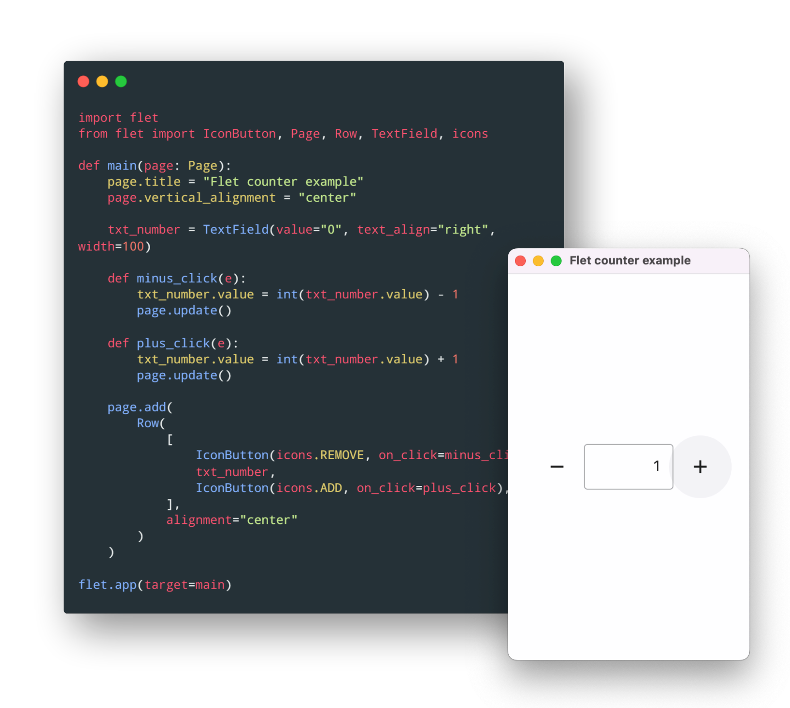

# Flet Belgeleri

Bu repo, [flet.dev/docs](https://flet.dev/docs/) adresindeki belgelerden yararlanarak, **Flet** hakkında Türkçe içerik (belge / doküman) oluşturma amacı taşımaktadır.

## Flet Nedir?

**Flet**, Front-End geliştirme deneyimi olmadan, en sevdiğiniz dilde etkileşimli çok kullanıcılı web, masaüstü ve mobil uygulamalar oluşturmaya izin veren bir çerçevedir.

Python'da Flutter uygulamaları oluşturmanın en hızlı yolu Flet kütüphanesini (modülünü) kullanmaktır. [Flet Kütüphanesi](https://pypi.org/project/flet/) Geliştiricilerin Python'da kolayca gerçek zamanlı web, mobil ve masaüstü uygulamaları oluşturmasına olanak tanır. 

# Bölümler

1. [Temel Özellikler](1_temel_ozellikler.md)

2. [Giriş / Takdim](2_giris.md)

3. [Python Rehberi](3_python_rehberi.md)
